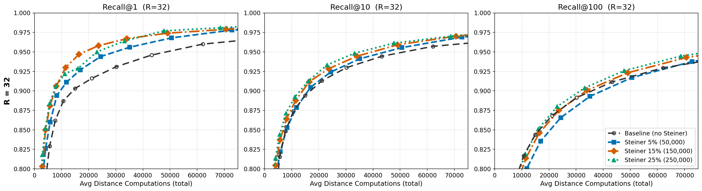

# Steiner-Augmented Vamana for Approximate Nearest Neighbor Search

This repository contains the code and experiment infrastructure for our study of **Steiner point augmentation** in Vamana-style graph-based approximate nearest neighbor (ANN) search. Steiner points, synthetic routing nodes such as k-means cluster centroids, are inserted into the graph to improve greedy search routing. They participate fully in graph construction and beam search but are excluded from the final result set.

## Key Idea

Standard graph-based ANN indices (e.g., Vamana / DiskANN) build a navigable small-world graph over the data points. We augment this graph with **Steiner points**: additional nodes that act as routing shortcuts through high-dimensional space. On datasets where greedy search struggles, Steiner points reduce the number of distance computations needed to reach a target recall, with improvements of up to **25% fewer distance computations** at matched Recall@1 on GloVe-200.

<p align="center">
  
</p>
<p align="center"><em>Recall vs. total distance computations on GloVe-200 (1M vectors, R=32). Steiner-augmented graphs (colored) consistently outperform the baseline (dashed black) across Recall@1, Recall@10, and Recall@100.</em></p>

## Results Summary

We evaluate on five standard ANN benchmark datasets (GloVe-200, NYTimes, SIFT, Fashion-MNIST, YFCC) with Steiner points at 5%, 15%, and 25% of the dataset size.

- **GloVe-200 & NYTimes**: Steiner augmentation provides clear improvements, achieving the same recall as the baseline with ~25% fewer total distance computations.
- **SIFT & Fashion-MNIST**: Baseline already near-perfect; Steiner points track the baseline with neither improvement nor degradation.
- **YFCC**: Steiner points actively degrade recall by 1-3 percentage points.

## Quick Start

### Prerequisites

- Python 3.10+
- [ParlayANN](https://github.com/cmuparlay/ParlayANN) (for parallel Vamana graph construction)
- [FAISS](https://github.com/facebookresearch/faiss) (for k-means clustering)

### Installation

```bash
git clone https://github.com/purnadutta/diskann_steiner.git
cd diskann_steiner
python -m venv .venv
source .venv/bin/activate
pip install -r requirements.txt
```

### Running an Experiment

```bash
python -m hiddenbridge.experiment \
    --dataset glove-200-angular \
    --train-size 1000000 \
    --query-count 1000 \
    --hidden-count 50000 \
    --max-degree 32 \
    --alpha 1.2 --top-k 100 \
    --use-parlay \
    --parlay-binary ~/ParlayANN/algorithms/vamana/neighbors
```

### Generating Plots

```bash
python scripts/plot_unity_sweep.py \
    --results-dir results_unity \
    --dataset glove_200_angular \
    --train-size 1000000 \
    --hidden-counts 50000 150000 250000 \
    --output plots_unity/glove1m_sweep.png \
    --paper --transpose
```

## Datasets

| Dataset       | Dim | n         | Metric    | Source |
|---------------|-----|-----------|-----------|--------|
| GloVe-200     | 200 | 1,000,000 | Cosine    | [ANN-Benchmarks](https://ann-benchmarks.com/) |
| NYTimes       | 256 | 290,000   | Cosine    | [ANN-Benchmarks](https://ann-benchmarks.com/) |
| SIFT          | 128 | 1,000,000 | Euclidean | [ANN-Benchmarks](https://ann-benchmarks.com/) |
| Fashion-MNIST | 784 | 60,000    | Cosine    | [ANN-Benchmarks](https://ann-benchmarks.com/) |
| YFCC          | 192 | 1,000,000 | Cosine    | [Big-ANN Benchmarks](https://big-ann-benchmarks.com/) |

