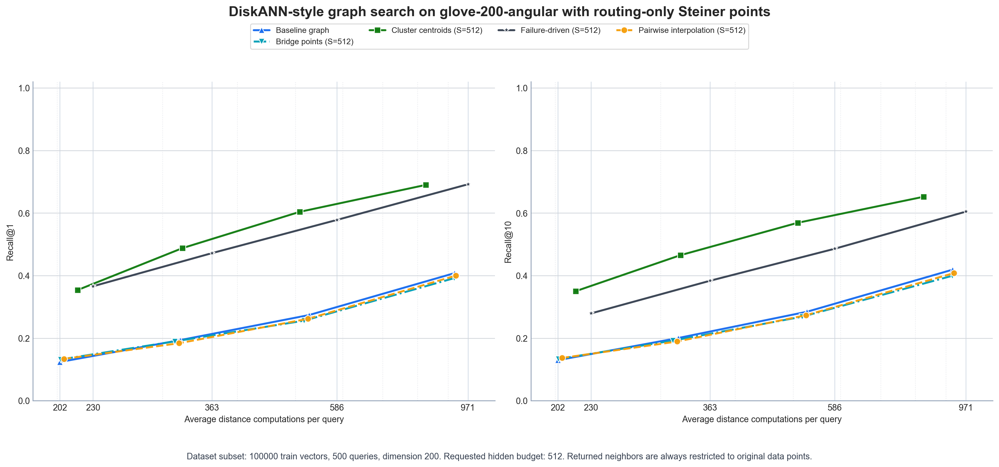
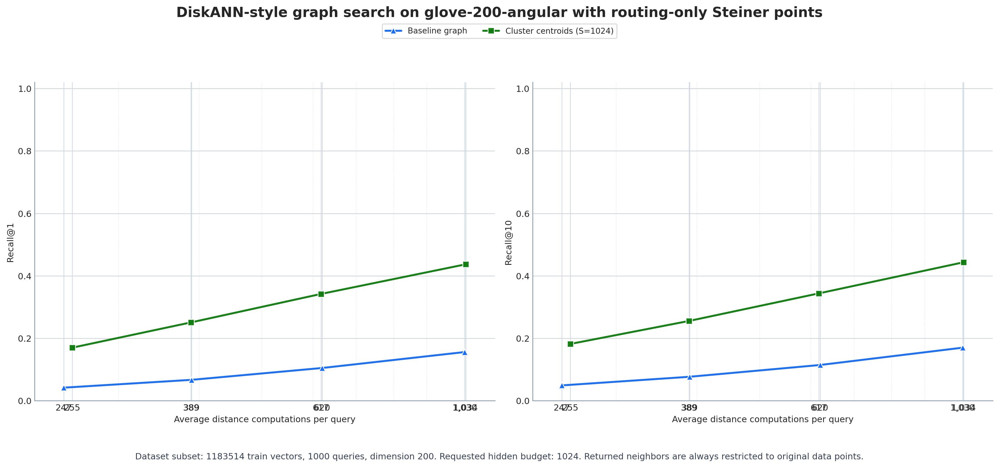

# HiddenBridge

HiddenBridge is a standalone research codebase for studying whether routing-only Steiner points can improve DiskANN-style graph nearest-neighbor search.

This repo focuses on:

- building a simplified Vamana/DiskANN-style fixed-degree proximity graph
- running beam-search graph traversal on top of that graph
- evaluating `recall@k`, average distance computations, and hop count
- comparing multiple Steiner-point augmentation strategies
- plotting recall-vs-compute tradeoffs and Steiner-budget ablations

Steiner points are used only for graph construction and graph navigation. They are never returned as final nearest-neighbor results.

## What Is Included

- core DiskANN-style graph build and beam-search evaluation
- 12 Steiner construction methods
- plotting for per-run tradeoff curves
- multi-run comparison plotting
- hidden-count ablation plotting
- local dataset download helpers for ANN-Benchmarks GloVe and SIFT
- local dataset registration helpers for precomputed array datasets, including OpenAI `1536` and `3072` embeddings

This repo intentionally does **not** include Modal wrappers, Modal configs, or downloaded dataset/artifact files.

## Selected Results

Representative non-failure-driven results are included below so the repository shows the main effect directly on GitHub without committing the full artifact tree.

- `glove-200-angular`, `100k` database, `500` queries:
  `cluster_centroid` clearly beats the plain graph. At beam `64`, baseline reached `Recall@10 = 0.4190` with `922.6` average distance computations, while `cluster_centroid` reached `Recall@10 = 0.6522` with `825.9` computations.
- full `glove-200-angular`, `1.18M` database, `1000` queries:
  `cluster_centroid` also beats baseline at full scale. By `Recall@10 AUC`, baseline was `0.1018` while `cluster_centroid` reached `0.3099`.





These are selected showcase figures only. The full local artifact set used during benchmarking stays outside this repo.

## Steiner Methods

Implemented methods:

- `pairwise_interpolation`
  Midpoints or convex-combination bridge points between selected original pairs.
- `cluster_centroid`
  K-means centroids used as routing-only nodes.
- `local_knn_mean`
  Local neighborhood means around important baseline nodes, with Steiner seeds used at query time.
- `random_line`
  Steiner points laid out along a random projected line through the dataset.
- `random_line_anchor`
  Random-line Steiner points plus a synthetic global anchor start node.
- `noisy_copy`
  Small-noise replicas around selected original points.
- `bridge`
  Bridge points between geometrically close but weakly connected regions.
- `hierarchical_centroid`
  Coarse and fine centroid levels that act as a routing hierarchy.
- `directional_centroid`
  Cluster centroids plus centroid-offset points along principal directions.
- `boundary_shell`
  Slightly outside-cluster shell points used as gateways.
- `failure_driven`
  Steiner points placed using baseline search failure traces.
- `targeted_noisy_replicas`
  Noisy replicas around hubs, bottlenecks, and frequently visited nodes.

Use one method with `--methods-csv cluster_centroid` or compare several at once with something like `--methods-csv cluster_centroid,failure_driven,bridge`.

## Parameter Guide

The experiment runner accepts one shared superset of parameters for every method. In practice, each Steiner construction only uses a subset of those knobs.

### Shared Parameters For Almost Every Run

- `--dataset-subdir`
  Which dataset folder under `data/` to load.
- `--train-size`
  Number of original database vectors included in the graph.
- `--query-count`
  Number of held-out queries used for evaluation.
- `--hidden-count`
  Requested Steiner budget. This is the main size knob for every Steiner method.
- `--top-k`
  Final result cutoff used for `recall@k`.
- `--beam-sizes-csv`
  Search beams evaluated for the recall-vs-compute curve.
- `--max-degree`
  Out-degree cap for the DiskANN-style graph.
- `--candidate-pool`
  Candidate pool size before graph pruning or fixed-degree selection.
- `--candidate-source`
  Candidate generation mode: `exact`, `ivf`, or `auto`.
- `--graph-build-strategy`
  Graph builder mode: `fixed`, `vamana`, or `auto`.
- `--ivf-nlist`
  IVF coarse cluster count when candidate generation uses FAISS IVF.
- `--ivf-nprobe`
  Number of IVF coarse clusters scanned per query or per node during candidate generation.
- `--ivf-overfetch`
  Extra IVF candidates fetched before trimming to the candidate pool.
- `--alpha`
  Vamana-style pruning aggressiveness. Only matters when `--graph-build-strategy vamana` is used.
- `--seed`
  Global random seed used by stochastic Steiner builders.

### Shared Parameters That Only Matter For Some Methods

- `--kmeans-niter`
  Number of k-means iterations. Used by centroid-based methods.
- `--noise-std`
  Noise scale for noisy replica methods.
- `--validation-query-count`
  Number of baseline validation queries used to mine search traces.
- `--validation-beam-size`
  Beam size used when collecting those validation traces.
- `--failure-recall-threshold`
  Threshold for deciding which validation searches count as failures.
- `--query-seed-candidate-count`
  Number of Steiner nodes considered as possible query-time seed nodes.
- `--query-seed-top-m`
  How many of those Steiner seed nodes are actually inserted at query time.
- `--line-gap-fraction`
  Minimum gap between neighboring random-line Steiner points, expressed as a fraction of the projected data span.
- `--line-shift-scale`
  Tiny orthogonal offset for random-line Steiner points so they do not collapse exactly onto one line sample.
- `--directional-directions-per-cluster`
  Number of principal directions kept per cluster for directional centroid methods.
- `--directional-offset-scale`
  Offset size along each principal direction.
- `--shell-scale`
  How far boundary-shell points are pushed outside their local cluster.
- `--local-mean-neighbor-count`
  Neighborhood size used when averaging local `k`-NN means.
- `--exact-batch-size`
  Batch size for exact assignment/scoring steps used inside some centroid-based methods.

## Method-Specific Parameters

### `pairwise_interpolation`

- Main knobs: `--hidden-count`
- Indirectly important: `--max-degree`, `--candidate-pool`, `--candidate-source`, `--graph-build-strategy`
- What it does:
  Chooses long baseline graph edges and inserts midpoint Steiner nodes.
- Notes:
  This method does not have extra dedicated parameters beyond the shared graph and hidden-count settings.

### `cluster_centroid`

- Main knobs: `--hidden-count`, `--kmeans-niter`
- Query-seeding knobs: `--query-seed-candidate-count`, `--query-seed-top-m`
- Randomness knob: `--seed`
- What it does:
  Runs k-means and uses centroids as routing-only Steiner nodes.
- Tuning intuition:
  Increase `--kmeans-niter` if centroids look unstable. Increase `--query-seed-top-m` if you want stronger centroid-based query entry, but that may increase compute.

### `local_knn_mean`

- Main knobs: `--hidden-count`, `--local-mean-neighbor-count`
- Validation-trace knobs: `--validation-query-count`, `--validation-beam-size`
- Query-seeding knobs: `--query-seed-candidate-count`, `--query-seed-top-m`
- Randomness knob: `--seed`
- What it does:
  Finds important baseline nodes, averages each node with a small local neighborhood, and uses those means as Steiner nodes plus diversified query-time seeds.
- Tuning intuition:
  `--local-mean-neighbor-count` controls how local versus smoothed the inserted means are. Smaller values stay more on-manifold; larger values create more aggressive smoothing.

### `random_line`

- Main knobs: `--hidden-count`, `--line-gap-fraction`, `--line-shift-scale`
- Randomness knob: `--seed`
- What it does:
  Places Steiner points along a random projected line through the dataset.
- Tuning intuition:
  Larger `--line-gap-fraction` spreads line points farther apart. Smaller `--line-shift-scale` keeps the points closer to the ideal line.
- Important note:
  The actual number of line points is capped to roughly `sqrt(n)` and may be smaller than `--hidden-count`.

### `random_line_anchor`

- Main knobs: `--hidden-count`, `--line-gap-fraction`, `--line-shift-scale`
- Randomness knob: `--seed`
- What it does:
  Same construction as `random_line`, but also adds a synthetic global anchor that can be used as the search start.
- Tuning intuition:
  Use this when you specifically want to test whether a global Steiner entry point helps navigation more than a random or medoid-like original start.

### `noisy_copy`

- Main knobs: `--hidden-count`, `--noise-std`
- Randomness knob: `--seed`
- What it does:
  Selects original points uniformly at random and adds slightly perturbed copies.
- Tuning intuition:
  Keep `--noise-std` small. If it is too large, the replicas stop behaving like local navigation aids and start distorting the graph.

### `bridge`

- Main knobs: `--hidden-count`
- Indirectly important: `--max-degree`, `--candidate-pool`, `--candidate-source`, `--graph-build-strategy`
- What it does:
  Inserts midpoint-like bridge points between geometrically close pairs that look weakly connected in the baseline graph.
- Tuning intuition:
  This method depends heavily on the baseline graph quality. Better baseline candidates usually produce more meaningful bridges.

### `hierarchical_centroid`

- Main knobs: `--hidden-count`, `--kmeans-niter`, `--exact-batch-size`
- Query-seeding knobs: `--query-seed-candidate-count`, `--query-seed-top-m`
- Randomness knob: `--seed`
- What it does:
  Splits the Steiner budget into coarse centroids and finer within-cluster centroids, creating a routing hierarchy.
- Tuning intuition:
  This method is useful when a single centroid layer is too coarse. `--exact-batch-size` matters because vectors must be assigned to the coarse centroids before fine centroids are built.

### `directional_centroid`

- Main knobs: `--hidden-count`, `--kmeans-niter`, `--exact-batch-size`
- Directional knobs:
  `--directional-directions-per-cluster`, `--directional-offset-scale`
- Randomness knob: `--seed`
- What it does:
  Adds a centroid plus small offsets along principal directions for each cluster.
- Tuning intuition:
  Increase `--directional-directions-per-cluster` if you want richer local directional structure. Keep `--directional-offset-scale` modest so the points stay near the cluster.

### `boundary_shell`

- Main knobs: `--hidden-count`, `--kmeans-niter`, `--exact-batch-size`, `--shell-scale`
- Randomness knob: `--seed`
- What it does:
  Places Steiner points slightly outside cluster boundaries so they behave like gateway nodes into those regions.
- Tuning intuition:
  `--shell-scale` is the main control. Too small and the shell points collapse back into the cluster; too large and they drift too far from useful routes.

### `failure_driven`

- Main knobs: `--hidden-count`
- Validation-trace knobs: `--validation-query-count`, `--validation-beam-size`, `--failure-recall-threshold`
- Indirectly important: `--max-degree`, `--candidate-pool`, `--candidate-source`, `--graph-build-strategy`
- What it does:
  Runs the baseline search on validation queries, identifies stuck searches or misses, and inserts Steiner points between stuck nodes and missed true neighbors.
- Tuning intuition:
  Increase `--validation-query-count` if you want more stable bottleneck statistics. Raise `--failure-recall-threshold` to mine more aggressive fixes, or lower it to only target clearly bad failures.

### `targeted_noisy_replicas`

- Main knobs: `--hidden-count`, `--noise-std`
- Validation-trace knobs: `--validation-query-count`, `--validation-beam-size`
- Randomness knob: `--seed`
- What it does:
  Adds noisy replicas only around important nodes such as hubs, bottlenecks, and frequently visited search states.
- Tuning intuition:
  Use this when plain `noisy_copy` is too random. Keep the noise small, since this method is intended to sharpen existing important routes rather than invent new geometry.

## Suggested Starting Settings

- `pairwise_interpolation`
  Start with `--hidden-count 512` or `1024`.
- `bridge`
  Start with `--hidden-count 512` or `1024` and a reasonably strong baseline graph such as `--candidate-pool 96`.
- `cluster_centroid`
  Start with `--hidden-count 512`, `--kmeans-niter 20`, `--query-seed-candidate-count 24`, `--query-seed-top-m 4`.
- `hierarchical_centroid`
  Start with `--hidden-count 512`, `--kmeans-niter 20`, `--query-seed-candidate-count 16`, `--query-seed-top-m 4`.
- `local_knn_mean`
  Start with `--hidden-count 512`, `--local-mean-neighbor-count 8`, `--query-seed-candidate-count 24`, `--query-seed-top-m 4`.
- `random_line` or `random_line_anchor`
  Start with `--line-gap-fraction 0.35` and `--line-shift-scale 0.0005`.
- `noisy_copy` or `targeted_noisy_replicas`
  Start with `--noise-std 0.002`.
- `directional_centroid`
  Start with `--directional-directions-per-cluster 2` and `--directional-offset-scale 0.08`.
- `boundary_shell`
  Start with `--shell-scale 0.12`.
- `failure_driven`
  Start with `--validation-query-count 250`, `--validation-beam-size 16`, `--failure-recall-threshold 0.5`.

## Installation

From the repo root:

```bash
python3 -m venv .venv
source .venv/bin/activate
pip install -r requirements.txt
```

`faiss-cpu` is strongly recommended for anything beyond toy runs.

## Dataset Layout

HiddenBridge expects each dataset under:

```text
data/<dataset_subdir>/
  train.npy
  test.npy
  dataset_metadata.json
  ground_truth_neighbors.npy          # optional but used when available
  ground_truth_distances.npy          # optional
  indices/                            # optional cached IVF indices
  analysis/graph_navigation/          # output plots/json/csv
```

## Download ANN-Benchmarks Datasets

Download full GloVe-200:

```bash
python -m hiddenbridge.download_ann_benchmark \
  --dataset glove \
  --data-root data
```

Download full SIFT-128:

```bash
python -m hiddenbridge.download_ann_benchmark \
  --dataset sift \
  --data-root data
```

## Register Existing Arrays

For datasets you already have as `train.npy` and `test.npy`, such as OpenAI embedding exports:

```bash
python -m hiddenbridge.register_dataset \
  --data-root data \
  --dataset-subdir dbpedia-openai3-large-3072-n101000-test1000 \
  --train-file /path/to/train.npy \
  --test-file /path/to/test.npy \
  --metric cosine \
  --normalize
```

Use `--metric euclidean` for Euclidean datasets and omit `--normalize` unless the metric should be cosine/IP.

## Register OpenAI Embedding Datasets

For OpenAI embedding exports, HiddenBridge includes a convenience wrapper that fixes the metric to cosine and enables normalization automatically.

Register a `1536`-dimensional OpenAI dataset:

```bash
python -m hiddenbridge.register_openai_dataset \
  --dimension 1536 \
  --train-file /path/to/openai_1536_train.npy \
  --test-file /path/to/openai_1536_test.npy \
  --data-root data
```

Register a `3072`-dimensional OpenAI dataset:

```bash
python -m hiddenbridge.register_openai_dataset \
  --dimension 3072 \
  --train-file /path/to/openai_3072_train.npy \
  --test-file /path/to/openai_3072_test.npy \
  --data-root data
```

If you want a specific dataset folder name instead of the defaults, pass `--dataset-subdir`.

## Run An Experiment

Example: GloVe `100k` database with two strong Steiner methods:

```bash
python -m hiddenbridge.experiment \
  --data-root data \
  --dataset-subdir glove-200-angular \
  --train-size 100000 \
  --query-count 500 \
  --hidden-count 512 \
  --top-k 10 \
  --max-degree 32 \
  --candidate-pool 96 \
  --beam-sizes-csv 8,16,32,64 \
  --methods-csv cluster_centroid,failure_driven \
  --candidate-source ivf \
  --graph-build-strategy fixed \
  --ivf-nprobe 32 \
  --validation-query-count 250 \
  --validation-beam-size 16
```

Example: full SIFT with all `10,000` queries:

```bash
python -m hiddenbridge.experiment \
  --data-root data \
  --dataset-subdir sift-128-euclidean \
  --train-size 1000000 \
  --query-count 10000 \
  --hidden-count 1024 \
  --top-k 10 \
  --max-degree 32 \
  --candidate-pool 96 \
  --beam-sizes-csv 8,16,32,64 \
  --methods-csv cluster_centroid,failure_driven,bridge,pairwise_interpolation \
  --candidate-source ivf \
  --graph-build-strategy fixed \
  --ivf-nprobe 32 \
  --validation-query-count 500 \
  --validation-beam-size 16
```

Example: OpenAI `1536` embeddings with a `100k` graph and `1,000` queries:

```bash
python -m hiddenbridge.experiment \
  --data-root data \
  --dataset-subdir openai-1536 \
  --train-size 100000 \
  --query-count 1000 \
  --hidden-count 512 \
  --top-k 10 \
  --max-degree 32 \
  --candidate-pool 96 \
  --beam-sizes-csv 8,16,32,64 \
  --methods-csv cluster_centroid,failure_driven,bridge,pairwise_interpolation \
  --candidate-source ivf \
  --graph-build-strategy fixed \
  --ivf-nprobe 32 \
  --validation-query-count 250 \
  --validation-beam-size 16
```

Example: OpenAI `3072` embeddings with a `100k` graph and `1,000` queries:

```bash
python -m hiddenbridge.experiment \
  --data-root data \
  --dataset-subdir openai-3072 \
  --train-size 100000 \
  --query-count 1000 \
  --hidden-count 512 \
  --top-k 10 \
  --max-degree 32 \
  --candidate-pool 96 \
  --beam-sizes-csv 8,16,32,64 \
  --methods-csv cluster_centroid,failure_driven,bridge,pairwise_interpolation \
  --candidate-source ivf \
  --graph-build-strategy fixed \
  --ivf-nprobe 32 \
  --validation-query-count 250 \
  --validation-beam-size 16
```

## Important Experiment Knobs

- `--train-size`
  Number of original database vectors used in the graph.
- `--query-count`
  Number of held-out queries used for evaluation.
- `--hidden-count`
  Requested Steiner-node budget.
- `--max-degree`
  Graph out-degree cap.
- `--candidate-pool`
  Candidate pool size before pruning or fixed-degree selection.
- `--beam-sizes-csv`
  Search beams to evaluate.
- `--methods-csv`
  Comma-separated Steiner methods to run.
- `--candidate-source`
  `exact`, `ivf`, or `auto`.
- `--graph-build-strategy`
  `vamana`, `fixed`, or `auto`.
- `--ivf-nprobe`
  IVF probe count when candidate generation uses IVF.

## Outputs

Each run writes:

- metrics JSON
- tradeoff plot PNG
- per-curve CSV table
- per-method summary CSV table

under:

```text
data/<dataset_subdir>/analysis/graph_navigation/
```

## Compare Multiple Runs

Compare multiple datasets or multiple experiment outputs:

```bash
python -m hiddenbridge.compare \
  --inputs \
    data/glove-200-angular/analysis/graph_navigation/run_a.json \
    data/sift-128-euclidean/analysis/graph_navigation/run_b.json \
  --output artifacts/benchmark_comparison.png
```

## Hidden-Count Ablation Plot

Combine several GloVe `100k` hidden-count runs into one plot:

```bash
python -m hiddenbridge.ablate_hidden_count \
  --inputs \
    data/glove-200-angular/analysis/graph_navigation/run_h512.json \
    data/glove-200-angular/analysis/graph_navigation/run_h4096.json \
    data/glove-200-angular/analysis/graph_navigation/run_h32768.json \
  --methods cluster_centroid,failure_driven \
  --output artifacts/glove_hidden_count_ablation.png
```

## Notes

- This is a simplified DiskANN-style research implementation, not the official Microsoft DiskANN codebase.
- Returned neighbors are always restricted to original dataset points.
- For large runs, IVF is only used to generate graph candidates. Search itself remains graph traversal.
- Exact brute-force ground truth is used when not already available from the dataset.
