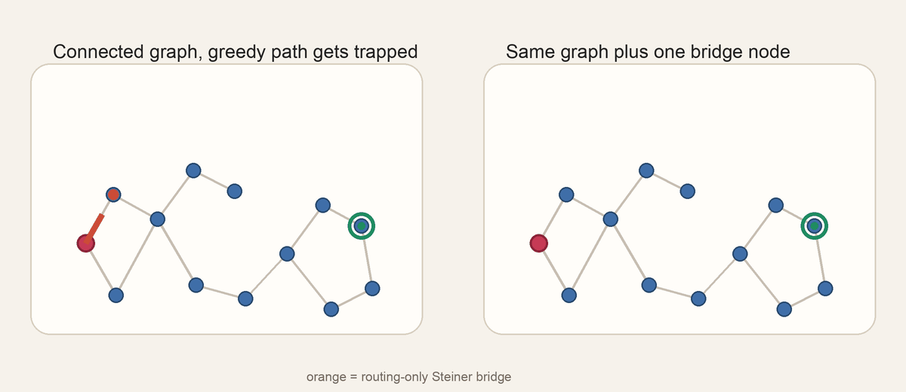

# HiddenBridge

HiddenBridge studies whether routing-only Steiner points can improve DiskANN-style graph nearest-neighbor search. Steiner nodes may participate in graph build and traversal, but never appear in the final returned neighbors.

This repo is intentionally the core research code only: no Modal wrappers, no downloaded datasets, and no local benchmark artifact dump.

## Start Here

- [Quickstart](docs/quickstart.md) for install, dataset setup, and runnable experiment commands
- [Steiner Methods](docs/methods.md) for the 12 methods and their knobs
- [Results Snapshot](docs/results.md) for the current benchmark takeaway
- [Bridge Demo](docs/bridge_navigation_demo.html) for the local interactive concept visual

## Selected Results

Current non-adaptive takeaway:
- `cluster_centroid` is the strongest overall method in the current artifact set
- `bridge` is the cleanest geometry-driven win on full `sift-128-euclidean`



Representative figures:
- `glove-200-angular`, `100k` database, `500` queries: `cluster_centroid` reaches `Recall@10 = 0.6522` at `825.9` average distance computations versus baseline `0.4190` at `922.6`
- full `glove-200-angular`, `1.18M` database, `1000` queries: `cluster_centroid` improves `Recall@10` AUC from `0.1018` to `0.3099`


## Quick Run

```bash
python3 -m venv .venv
source .venv/bin/activate
pip install -r requirements.txt

python -m hiddenbridge.download_ann_benchmark --dataset glove --data-root data

python -m hiddenbridge.experiment \
  --data-root data \
  --dataset-subdir glove-200-angular \
  --train-size 100000 \
  --query-count 500 \
  --hidden-count 512 \
  --beam-sizes-csv 8,16,32,64 \
  --methods-csv cluster_centroid,bridge,pairwise_interpolation \
  --candidate-source ivf \
  --graph-build-strategy fixed \
  --ivf-nprobe 32
```

The full command guide, per-method parameter notes, and extra examples live in the docs pages above.
